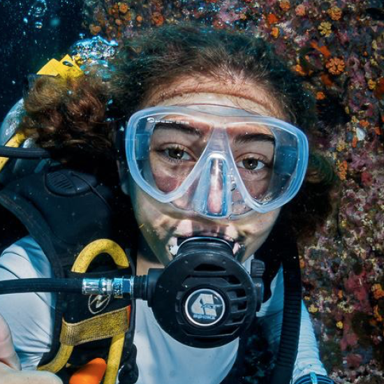

# Alessandra Quigley

## Education

[Columbia University](https://www.columbia.edu/)  2024-?

[University College London](https://www.ucl.ac.uk/) 2019-2023

## Research interests

I study marine extremes and biogeochemical responses. My first research project will look at dust storms in the Southern Ocean and their impact on circulation and primary production.